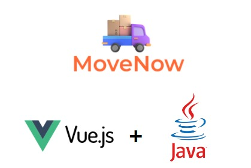

    

MoveNow es una solución innovadora que revoluciona la forma en que hacemos mudanzas. Con nuestra aplicación, hemos diseñado una herramienta que simplifica todo el proceso, haciéndolo más fácil, más rápido y más eficiente que nunca. Permítanme compartirles algunos de los puntos clave que la hacen destacar:

<ul>
    <li>Organización sin esfuerzo: podrás planificar y gestionar tu mudanza de manera impecable. Con nuestra aplicación, obtendrán presupuestos detallados y transparentes para elegir la opción que mejor se ajuste a sus necesidades y presupuesto.</li>
    <li>Seguimiento en tiempo real: Olvídense de preguntarse dónde están sus pertenencias. Nuestra aplicación les proporciona seguimiento en tiempo real para que siempre sepan dónde se encuentran sus objetos durante el traslado.</li>
    <li>Reseñas y calificaciones: Queremos que se sientan seguros al elegir una empresa de mudanzas. Por eso, nuestra app cuenta con reseñas y calificaciones honestas de otros usuarios, para que puedan tomar decisiones informadas.</li>
</ul>

En resumen, nuestra app de mudanza les proporciona comodidad, transparencia y tranquilidad en un momento tan estresante como es una mudanza. Ahorren tiempo, dinero y esfuerzo con nuestra innovadora solución.

<h2>🚀 Demostración</h2>

Puedes ver una demostración de la plataforma en el siguiente enlace:

<a href="https://movenow-three.vercel.app/" target="_blank">https://movenow-three.vercel.app/</a>

<h2>Capturas de pantalla del proyecto</h2>

Puedes ver las capturas de pantalla del proyecto en Figma:

<a href="https://www.figma.com/file/e5FRUJ4A7yOmW5N2Cifcd9/MoveNow?type=design&node-id=167-481&mode=design&t=9HvNqn5i3YzNUxQo-0" target="_blank">Capturas de pantalla</a>

<h2>🛠️ Pasos de instalación</h2>
<ol>
    <li>Clonar el repositorio:</li>
    <code>$ git clone https://github.com/No-Country/s9-08-t-java-vue.git</code>
    <li>Instalar módulos npm:</li>
    <code>$ npm install</code>
    <li>Cree una compilación de producción usando el siguiente comando:</li>
    <code>$ cd ../path/to/the/file</code>
    <li>Verifique la compilación de producción localmente usando el siguiente comando:</li>
    <code>$ npm start</code>
</ol>

<h2>💻 Construido con:</h2>

Back-End:

<ul>
    <li>JAVA Spring Boot</li>
</ul>

Front-End:

<ul>
    <li>VueJs</li>
</ul>

Base de Datos:

<ul>
    <li>MySql</li>
</ul>

Diseño UX/UI:

<ul>
    <li>Figma</li>
</ul>

Deploy:

<ul>
    <li>Back-End: Render</li>
    <li>Front-End: Vercel</li>
</ul>

Gestión:

<ul>
    <li>Jira</li>
    <li>Slack</li>
    <li>Meet</li>
    <li>Discord</li>
</ul>

<h2>🙋🏼‍♀️ Historias de usuario:</h2>
<ol>
    <li>Como usuario administrador quiero registrar una flota de camiones para que se puedan alquilar para los fletes</li>
    <li>Como usuario administrador quiero poder ver el estatus de cada camión para saber cuáles están disponibles para fletes</li>
    <li>Como Cliente quiero poder elegir un camión acorde a lo que necesito para realizar un flete</li>
    <li>Como cliente quiero seleccionar el tiempo de alquiler del transporte para poder calcular cuánto voy a pagar</li>
    <li>Como cliente quiero ver la tarifa de pago para poder tener el dinero gestionado para el pago</li>
    <li>Como cliente quiero poder ver en donde se encuentra mi flete para hacer un seguimiento constante del mismo</li>
    <li>Como cliente quiero poder agregar una ubicación origen y una ubicación destino para poder indicar el camino de mi viaje (mudanza)</li>
</ol>

<h2>🛡️ Colaboradores:</h2>

UI/UX

<ul>
    <li>Nayib Sales - <a href="https://www.linkedin.com/in/nayib-sales-059623218">LinkedIn</a>, <a href="https://www.behance.net/nayibsales">Behance</a></li>
    <li>Angie Becerra - <a href="https://www.linkedin.com/in/angie-kelly-becerra-contreras-b55682228/">LinkedIn</a>, <a href="https://www.behance.net/angiebecerra">Behance</a></li>
</ul>

BACK-END

 <ul>
        <li>Andersson Godoy - <a href="https://www.linkedin.com/in/andersson-godoy/">LinkedIn</a>, <a href="https://github.com/anderssongodoy">GitHub</a></li>
        <li>Ricardo Tolomei - <a href="https://www.linkedin.com/in/ricardo-andr%C3%A9s-tolomei-99a4b380/">LinkedIn</a>
        <li>Cristian Mesiano - <a href="https://www.linkedin.com/in/cristian-gabriel-mesiano/">LinkedIn</a>, <a href="https://github.com/KBRIEL">GitHub</a></li>
        <li>Daniel Matos - <a href="https://www.linkedin.com/in/daniel-matos-echevarria/">LinkedIn</a>, <a href="https://github.com/Daniel-M12">GitHub</a></li>
        <li>Gabriel Iezzi - <a href="https://www.linkedin.com/in/gabriel-iezzi-13a405ba">LinkedIn</a>, <a href="https://github.com/gabiezzi">GitHub</a></li>
    </ul>
    <h3>FRONT-END</h3>
    <ul>
        <li>Maximiliano Arbelais - <a href="https://github.com/arbelais">GitHub</a>, <a href="https://www.linkedin.com/in/arbelaism">LinkedIn</a></li>
        <li>Mayder Cortés - <a href="https://www.linkedin.com/in/mayderc/">LinkedIn</a>, <a href="https://github.com/MayderC">GitHub</a></li>
    </ul>
    <h3>PM</h3>
    <ul>
        <li>Noriesly Freitez - <a href="https://www.linkedin.com/in/norielsyfreitez/">LinkedIn</a></li> 
        
   

